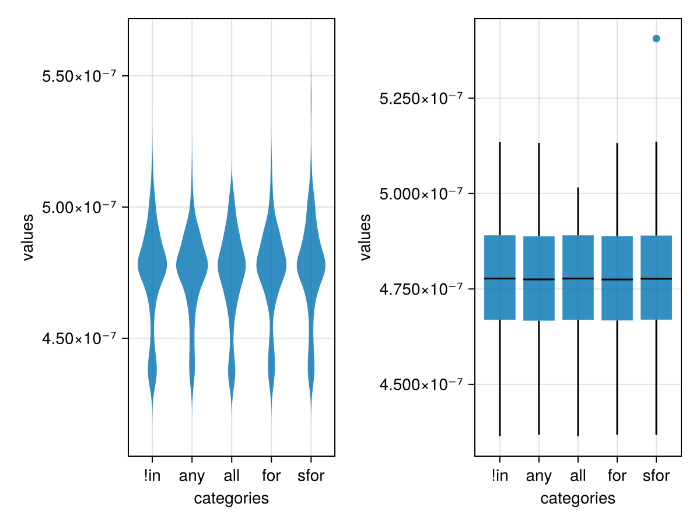

# Julia `not in` benchmark

Turns out there are a range of ways to perform the operation $\text{element} \notin \text{collection}$. This simple repository is dedicated to study the performance impact of choosing a writing among others.

Here is what I get:

```julia
# Parameters
NB_VERTICES = 1000  # Number of vertices
NB_ROUTES = 1000  # Number of routes to generate
MAX_ROUTE_SIZE = 1000  # Maximum route size
ITERATIONS = 100  # Number of iterations for each test
```

Results:
```
Method: !in Results:  Mean: 4.741224284129747e-7 Std: 1.905167918928099e-8
Method: any Results:  Mean: 4.74334978316611e-7 Std: 1.5981341335909413e-8
Method: all Results:  Mean: 4.7388496802150037e-7 Std: 1.7295353118322162e-8
Method: for Results:  Mean: 4.747417947615649e-7 Std: 1.7384824081541754e-8
Method: sfor Results: Mean: 4.759807047715669e-7 Std: 1.9178525661399665e-8
```




